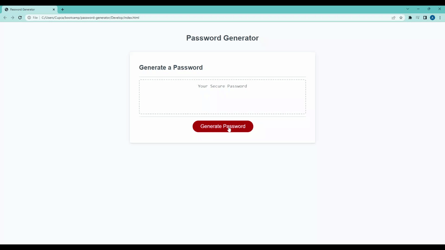

# Angela's Password Generator

## Description

Hello and welcome to my password generator application! Here you can generate a safe and secure password based on your criteria. In this application you can have a password generated between 8-129 characters long! you can generate a password with numbers, uppercase letters, lowercase letters, and special characters.

## Snapshot
 
[Active website link](#file:///C:/Users/Cupca/bootcamp/password-generator/index.html)

## process 

I was given starter code for this password generator but none of the functions had code inside. In this generator I created variables, loops, arrays and methods to make this generator function properly to the users input to generate a safe and secure password.

## languages

HTML/CSS/JS

## author

Angela Amaro

## Contact 

[My GitHub](https://github.com/Angela-Amaro)

[My Linkedin](https://www.linkedin.com/in/angela-amaro-342792204/)